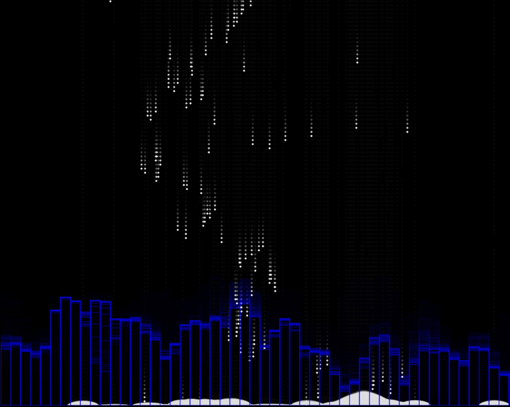

<h1 align="center">暗夜雪花</h1>

<sm>计算机图形学 Project 1 - 音频可视化</sm>

夜幕下涌动的蓝色是静谧的城市，天空飘来浪漫的白色雪花

## 说明
蓝色的波浪是音频的频域图（傅里叶变换）

白色的雪花是音频时域图（correlation method pitch detection）

雪花落到地面上的效果是卷积

本可视化效果牵扯到pitch-detection，用钢琴独奏类音乐效果会好很多

## 参考资料
* https://github.com/cwilso/pitchdetect
* https://codepen.io/awesomecoding/pen/rVBaab